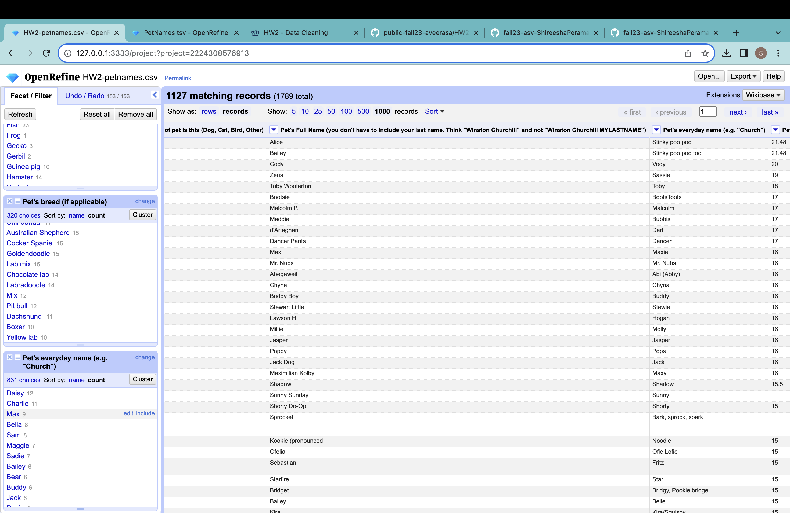

# HW 2 - CS 625, Fall 2023

Shireesha Peramasani
Due: September 20, 2023

## Part 1. Data Cleaning
*1. After creating project, in the process of cleaning the data firstly I applied text facet and clustered for the What kind of pet is this (Dog, Cat, Bird, Other) and manually edited some cell choices*

*2.Checking for duplicate rows
Using pet's full name as unique key, I checked for duplicate rows
For the pet's full name column clicked down arrow to select facet in it selected text facet, in that I checked for the count of each value to check if the count of any value is more than 1, but I didn't find any duplicate rows in the given data.

3. Merging the kind of pets and breeds and applying different clusters.
In this method I have selected the "What kind of pet is this" column, clicked on cluster selected merge.
a. Method- Key Collection,  keying function- Fingerprint
b. Method- Nearest neighbor, Distance  function- Levenshtein
c. Method- key collision, Keying function- Metaphone3
d. Method- Key collision, Keying function- Daitch-Mokotoff
e. Method- Key collision, keying function- Beider-Morse

   
4. I have sorted same kind of animals into one category
Using split multi-valued cells function I have seprated this using "," or ";" separator

5. Transform: used GREL experesions for Pet's age
   a. value.replace(/[^0-9.]/, '')
   b. if (value.contains('mo'), value.replace(/[^0-9.]/, '').toNumber() / 12.0, value)
   c. if (value.contains('weeks'), value.replace(/[^0-9.]/, '').toNumber() / 52.0, value)
   d. if (value.contains('years'), value.replace(/[^0-9.]/, '').toNumber(), value)
   e. join(split(value, ' ')[0, 2], ' '), '')

6.  Sorting smallest to largest
   

## Part 2. Analyze Cleaned Data
*1. How many types (kinds) of pets are there?*
After the data cleaning is done, i got 23 choices in 'what kind of pet is this' column which means there are 23 types(kinds) of pets shown in the data sheet.

*2.How many cats?*
In the text facet we can see the number of cats as 503.

*3. How many breeds of cats?*
When I crossed checked after clustering cells  and for the text facet for Pet's breed by including cats category i found the types of breeds which is number of choices as- 89.

*4. What's the most popular cat breed? How many cats are in that breed?*
The most popular cat breed is after clustering Pet's breed is Domestic shorthair. This breed has 69 cats in it.

*5. What's the age range of the cats?*
To get the range first sorted column Pet's age using smallest number method and the largest methods
When selected the Sort option and upon choosing the smallest first we get the youngest Cat’s age as 0.11 
When selected the Sort option and upon choosing the largest first we get the oldest  Cat’s age as 24
The age range of the cats is 0.11 to 24.

*6. What's the age range of the rabbits? (Don't forget to look for bunny, too.)*
To get the range first sorted column Pet's age using smallest number method and the largest methods
When selected the Sort option and upon choosing the smallest first we get the youngest Cat’s age as 1.75
When selected the Sort option and upon choosing the largest first we get the oldest  Cat’s age as 13
The age range of the cats is  1.75 to 13.

*7. What is the oldest pet? Give the pet's name, kind, and age.*
The oldest pet's name is  Bruce Springsteen 
Kind or the pet's breed name is Polydactyl Short Cat
And the age of the pet is 24

*8. What are the top 5 most popular dog breeds? List the breed and number.*
Top 5 most popular dog breeds are
1. Golden Retriever - 172
2. Mutt - 35
3. Labrador Retriever - 31
4. Border Collie - 26
5. German Shepherd - 26

   
*9. What's the most popular everyday name for a dog?*
The most popular everyday name for a dog is Daisy.

*10.What's the most popular full name any pet?*
The most popular everyday name for a dog is Bailey.

*References:*

*CSV file: <https://github.com/odu-cs625-datavis/fall23-asv-ShireeshaPeramasani/blob/main/HW2-petnames.csv>*
*JSON file: <https://github.com/odu-cs625-datavis/fall23-asv-ShireeshaPeramasani/blob/main/HW2-petnames.json>*

